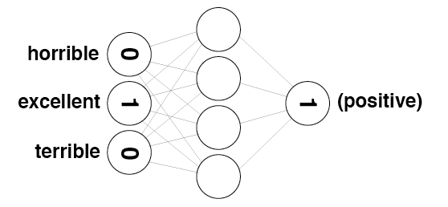

## Neural-Networks-implementation

Neural network for daily bike rental ridership.

## What is Neural-Networks?

A neural network is a series of algorithms that endeavors to recognize underlying relationships in a set of data through a process that mimics the way the human brain operates. In this sense, neural networks refer to systems of neurons, either organic or artificial in nature.

## Sentiment Network

  

  

  

  

  

